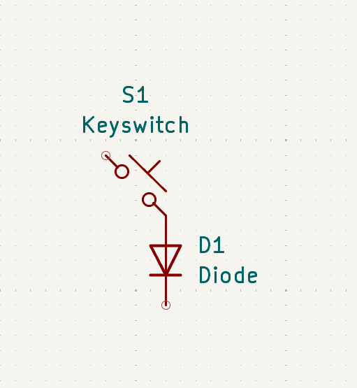

title: "Cool Keyboard"
author: "Sidak Singh"
description: "A keyboard which is actually good; hopefully at least ;)"
created_at: "2024-05-24"

Tue Jun 24 2025 (First day) 4 hours
going to start planning what I am doing what the idea is and how it is roughly going to work now that expericed so we will see how it goes;

Idea:
modular 
low hiegh 
lcd screen which plays game based on you typing speed and acuary (slightly tiled from the top)
rgb everywhere 
machincal 
hot swappable 
some dials on the top
sexy build

Modules: 
Audio mixer (Left)
Num pad righ (right)

Reaserch (insperatio)
this kind of led bar 
https://github.com/masaleiro/HacKeyboard
80% size

board 
ESP32-S3-DevKitC-1 with WROOM-2 32 MB Flash + 8 MB Octal PSRAM
https://www.amazon.com/SANXIXING-Development-Module-Internet-ESP32-S3-WROOM-1/dp/B0DB1WK3CW/ref=sxin_17_pa_sp_search_thematic_sspa?content-id=amzn1.sym.2da95b6c-f59a-4699-bc43-d0ff036c6388%3Aamzn1.sym.2da95b6c-f59a-4699-bc43-d0ff036c6388&cv_ct_cx=esp32&keywords=esp32&pd_rd_i=B0DB1WK3CW&pd_rd_r=f0f021fb-fc42-42db-a982-2a0d24d234dd&pd_rd_w=LAz4G&pd_rd_wg=zPjgt&pf_rd_p=2da95b6c-f59a-4699-bc43-d0ff036c6388&pf_rd_r=K3V46M70WGZQSM9RFQJN&qid=1750802869&sbo=RZvfv%2F%2FHxDF%2BO5021pAnSA%3D%3D&sr=1-1-6024b2a3-78e4-4fed-8fed-e1613be3bcce-spons&sp_csd=d2lkZ2V0TmFtZT1zcF9zZWFyY2hfdGhlbWF0aWM&psc=1
somehow buying 3 is cheaper than one

going to learn easy eda lol ;)
watching this 16min vid https://www.youtube.com/watch?v=utBQqcuOt9U
yea video was usless will learn as i goes

learn how a keyboard works 
https://www.youtube.com/watch?v=7LyziNdFlew

direct wiring:
a single pin per pin 

matrix diode 
use diode for n key rol over ghosting 
diods only for rows 
coloums dont have diodes 

ye I give up on esey eda 
nothign works 

I am switching to ki cad we will see if my laptop can run or not
notes: 

Thu Jun 26 
Started following a tutrotial on ki kad 

stuck idk any commands; cant even get copy paste to work 

some more chat gpt resaarch 

✅ 5-Pin MX Switches
Pads:
2 for electrical contacts
2 for plastic stability legs
1 center hole (optional mechanical post)

Kailh Socket MX Hotswap

02 Jun 2025 (2H)
got a basic idea on how the keyboard is going to look

- use uart prototcol between module for data transfer
- can remapp any pins to work for rx and tx
- set rows as output 
- set colloums to input
- connect with with magnet pogo pin connection 
- probs need ribbion cabels 
- need to check how to make the 90deg connections
- basic excali draw layout with eveything I need 
- just need to finnalise the exact pins 

03 Jun 2025 (6h)
- Swtiched over to linuix could not get ki cad to work for 2h 
- display module: https://www.aliexpress.com/item/1005008937314193.html?spm=a2g0o.productlist.main.37.689cl1WLl1WLYf&utparam-url=scene%3Asearch%7Cquery_from%3Apc_back_same_best&algo_pvid=04323b26-192f-4ec3-9295-e29557edd303&algo_exp_id=04323b26-192f-4ec3-9295-e29557edd303&pdp_ext_f=%7B%22order%22%3A%22261%22%7D&pdp_npi=4%40dis%21CAD%2112.70%211.38%21%21%2165.41%217.11%21%402103247917515698026168028e09d7%2112000047274995308%21sea%21CA%210%21ABX#nav-specification
- made pin layout txt
