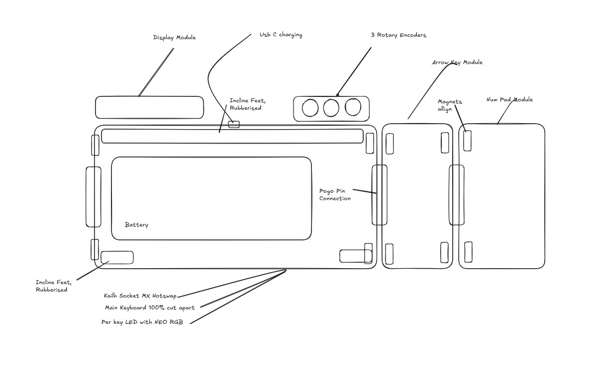

title: "Cool Keyboard"
author: "Sidak Singh"
description: "A keyboard which is actually good; hopefully at least ;)"
created_at: "2024-05-24"

Tue Jun 24 2025 (First day) 4 hours
going to start planning what I am doing what the idea is and how it is roughly going to work now that expericed so we will see how it goes;

Idea:
modular
low hiegh
lcd screen which plays game based on you typing speed and acuary (slightly tiled from the top)
rgb everywhere
machincal
hot swappable
some dials on the top
sexy build

Modules:
Audio mixer (Left)
Num pad righ (right)

Reaserch (insperatio)
this kind of led bar
https://github.com/masaleiro/HacKeyboard
80% size

board
ESP32-S3-DevKitC-1 with WROOM-2 32 MB Flash + 8 MB Octal PSRAM
https://www.amazon.com/SANXIXING-Development-Module-Internet-ESP32-S3-WROOM-1/dp/B0DB1WK3CW/ref=sxin_17_pa_sp_search_thematic_sspa?content-id=amzn1.sym.2da95b6c-f59a-4699-bc43-d0ff036c6388%3Aamzn1.sym.2da95b6c-f59a-4699-bc43-d0ff036c6388&cv_ct_cx=esp32&keywords=esp32&pd_rd_i=B0DB1WK3CW&pd_rd_r=f0f021fb-fc42-42db-a982-2a0d24d234dd&pd_rd_w=LAz4G&pd_rd_wg=zPjgt&pf_rd_p=2da95b6c-f59a-4699-bc43-d0ff036c6388&pf_rd_r=K3V46M70WGZQSM9RFQJN&qid=1750802869&sbo=RZvfv%2F%2FHxDF%2BO5021pAnSA%3D%3D&sr=1-1-6024b2a3-78e4-4fed-8fed-e1613be3bcce-spons&sp_csd=d2lkZ2V0TmFtZT1zcF9zZWFyY2hfdGhlbWF0aWM&psc=1
somehow buying 3 is cheaper than one

going to learn easy eda lol ;)
watching this 16min vid https://www.youtube.com/watch?v=utBQqcuOt9U
yea video was usless will learn as i goes

learn how a keyboard works
https://www.youtube.com/watch?v=7LyziNdFlew

direct wiring:
a single pin per pin

matrix diode
use diode for n key rol over ghosting
diods only for rows
coloums dont have diodes

ye I give up on esey eda
nothign works

I am switching to ki cad we will see if my laptop can run or not
notes:

Thu Jun 26
Started following a tutrotial on ki kad

stuck idk any commands; cant even get copy paste to work

some more chat gpt resaarch

✅ 5-Pin MX Switches
Pads:
2 for electrical contacts
2 for plastic stability legs
1 center hole (optional mechanical post)

Kailh Socket MX Hotswap

02 Jun 2025 (2H)
got a basic idea on how the keyboard is going to look

- use uart prototcol between module for data transfer
- can remapp any pins to work for rx and tx
- set rows as output
- set colloums to input
- connect with with magnet pogo pin connection
- probs need ribbion cabels
- need to check how to make the 90deg connections
- basic excali draw layout with eveything I need
- just need to finnalise the exact pins

03 Jun 2025 (6h)
- Swtiched over to linuix could not get ki cad to work for 2h
- display module: https://www.aliexpress.com/item/1005008937314193.html?spm=a2g0o.productlist.main.37.689cl1WLl1WLYf&utparam-url=scene%3Asearch%7Cquery_from%3Apc_back_same_best&algo_pvid=04323b26-192f-4ec3-9295-e29557edd303&algo_exp_id=04323b26-192f-4ec3-9295-e29557edd303&pdp_ext_f=%7B%22order%22%3A%22261%22%7D&pdp_npi=4%40dis%21CAD%2112.70%211.38%21%21%2165.41%217.11%21%402103247917515698026168028e09d7%2112000047274995308%21sea%21CA%210%21ABX#nav-specification
- made pin layout txt

July 10 2025 (3h)
- been a while since I worked on this going to refersh the memory and read a rticle
https://magazine.raspberrypi.com/articles/how-i-made-a-pcb-mechanical-keyboard
started the actual pcb
had to refacttor everything since the led too too muhc space
even after the shrinking there size in shcematic edditor

july 12 2025 4h
Need to work on the bms system
after looking online for too long I cant find a symbol which matches my pupose for the tp405 so I am going to make my own symbol
turns out I am dumbass and I made a foot print instead of the symbol
lol good waste of 15 mins
leared how ot make a symbol
made symbol for mt3608 and tp4056
changed pin layout to make the encoder clickabel
added pin layout for uart3 and uart 2
added connectins for the screen in

July 14
So ran into a small porblem not all the pins on the esp32 are exposed
When I did priod pin planning chat gpt told me it works
but chat gpt is preety stupid
so I will have to manuely reconfiger everything
I phyciallt dont have enough pins and need to cut down quite bit.
some reasech later I can switch to a tiny board
use a expander thou it is very slow and cant do rx tx;
hook up 2 esp32

I cant think of any soultions so we going to move the rotatre encoder to the othe module esp
we have a plan again boyz lets go
using every single pin out there

got the neo pixels set up with a level shifter
foudn a bms board to use
https://www.aliexpress.com/item/1005009114238312.html?spm=a2g0o.productlist.main.6.297aIxBSIxBS8w&aem_p4p_detail=20250714115114454699415870150000722181&algo_pvid=918adb0b-d6f3-4d48-a0fc-2aa31cf362dd&algo_exp_id=918adb0b-d6f3-4d48-a0fc-2aa31cf362dd-5&pdp_ext_f=%7B%22order%22%3A%22-1%22%2C%22eval%22%3A%221%22%7D&pdp_npi=4%40dis%21CAD%210.70%210.63%21%21%213.56%213.20%21%40210318ec17525190740772470e51e3%2112000047966529768%21sea%21CA%210%21ABX&curPageLogUid=OozQZC1fKPWE&utparam-url=scene%3Asearch%7Cquery_from%3A&search_p4p_id=20250714115114454699415870150000722181_2

finsshed the top module still had to remove a encoder due to lack of pins

considring changing the design a bit not fully sure

july 15
got alot of work done yesterday not sure if it going to transfer over to totday
designed the middle righgt module
the wirring atleast
finshed all the schematics and wirring flags with the  middle module
need to add all the foot prints now
means I gotta make some footprint
got the foot rpint for the switch and that is about it
already knew it would kinda unporductive
but tommory should be better

July 17
found this eoncder dont wana make foot print; but might have to
https://www.amazon.ca/Cylewet-Encoder-Digital-Potentiometer-Arduino/dp/B07G9Z5CG3/ref=asc_df_B07G9Z5CG3?mcid=83240136b38133afb3da3ceaa754b17b&tag=googleshopc0c-20&linkCode=df0&hvadid=706724917350&hvpos=&hvnetw=g&hvrand=15515757723512613680&hvpone=&hvptwo=&hvqmt=&hvdev=c&hvdvcmdl=&hvlocint=&hvlocphy=9190488&hvtargid=pla-774433431987&psc=1&hvocijid=15515757723512613680-B07G9Z5CG3-&hvexpln=0&gad_source=1
scrath that

using EC11 for the rotart encoder

using this as the mt3608 board
https://www.aliexpress.com/item/1005006519538977.html?src=google&pdp_npi=4%40dis!CAD!11.58!3.81!!!!!%40!12000037512742087!ppc!!!&src=google&albch=shopping&acnt=631-313-3945&isdl=y&slnk=&plac=&mtctp=&albbt=Google_7_shopping&aff_platform=google&aff_short_key=UneMJZVf&gclsrc=aw.ds&&albagn=888888&&ds_e_adid=&ds_e_matchtype=&ds_e_device=c&ds_e_network=x&ds_e_product_group_id=&ds_e_product_id=en1005006519538977&ds_e_product_merchant_id=5326692037&ds_e_product_country=CA&ds_e_product_language=en&ds_e_product_channel=online&ds_e_product_store_id=&ds_url_v=2&albcp=19366866438&albag=&isSmbAutoCall=false&needSmbHouyi=false&gad_source=1&gad_campaignid=17337458112&gclid=CjwKCAjwvuLDBhAOEiwAPtF0VvaBbNKC3p7mBnuoVa8Ror3WDXSZfy9sSTaxqzSKNfbtcTIF4VpFghoChtkQAvD_BwE
going to have to make a custom foot print

I installed foot prints but my things dont have pins that connect
I am going to switch it out for keep out zones with
undoing so mich work
trying ot make the board foot rpint gfor mt3608 but cant figure out to make akeep out zone
made and assigned the foot from fot mt3608 but the wriing is not ritwe ZI made sure the pin numbe ris correct but idk will troibleshoot later
JUST GOT 74nh... foot print assigned correctly the volatge leevl shifter

did the foot print for the bms board but the wirrring is still not ligned up

the issue was with the tp4056 board made my own foot print for this one
https://www.aliexpress.com/item/1005008145821171.html?spm=a2g0o.productlist.main.2.76582274lLMqDO&aem_p4p_detail=202507181524554208539047139890001870489&algo_pvid=6bb3cdce-ef62-4a96-9fac-22bcc3f7eeff&algo_exp_id=6bb3cdce-ef62-4a96-9fac-22bcc3f7eeff-1&pdp_ext_f=%7B%22order%22%3A%221197%22%2C%22eval%22%3A%221%22%7D&pdp_npi=4%40dis%21CAD%213.13%211.39%21%21%2115.99%217.09%21%40210330dd17528774951822738ec2ea%2112000044264539063%21sea%21CA%210%21ABX&curPageLogUid=p2Bmyk5OeMyR&utparam-url=scene%3Asearch%7Cquery_from%3A&search_p4p_id=202507181524554208539047139890001870489_1
made a new foot print for my cell type 26650

apperntly the way installed ki cad does not allow python scripts to run for plug ins so I have re install ki cad

july 28
been a very long while since I have dont anything to this
idk what I was doing last time but I wana finish this today so I
can get to work on other things so I will finish even I dont get to sleep

asked chat gpt how I should do it
it said use a create array feature
turns out that is not usefull here

changed the foot print to version which lets me mount on either side of the pcb

I spent 3 fucking ours trying to get to the grid to snap just relise what I was doing was wrong and the tutorial was right fuck this shit
I am going to cry the grid still does not snap properly I have changed the foot prints to keibo ones now
and apparetnly all my other foot prints have gone missing again

I got the trick I think I have to select the bottom pin number 2 for it snap properly
I give I will look at the missing module later
just goin gto allign the keys now

ahhh I am him I am done the main body like alligned not wired

ahh I am him it 12 at miofnight but I finished placing all the components where they belong just need to find the missing module and place it

July 29
I was right I just had to figure the foot print had not been delted I just had to fugure out where it was stored and relink it again

I have a new error now some of the pads seems like are not alligned
seems like a quick fix just reassigned the pins to the correct order

finshed wirirng eveyr switch diode led took 8 h

added test points to add the magentic pogo connection
change in sym and pcb

connnected the pogo goin gto run drc

drc gave 200 errors and said 43 things were not connected properly back to table

just went thorugh hell solving all the unconnete drc items
still have other issues
and just found out about erc
all the wires are connected and I will come back to the other issues later going to model the case now

july 31
I was out yesterday and today is the last day so I guess I will have to finish no matter what
goiing to learn fusion 360 and make it
but I have to switch over to windows first
